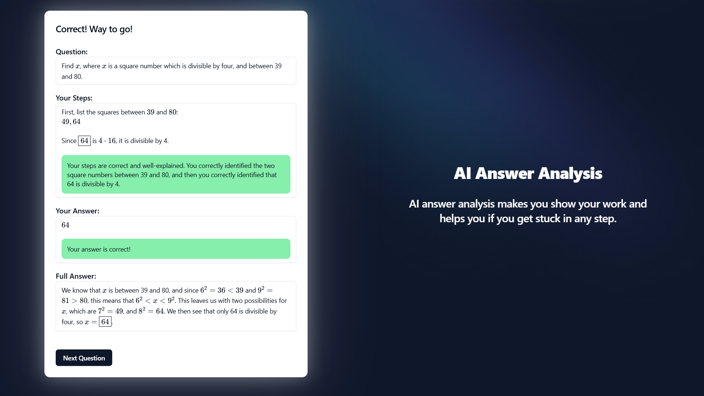
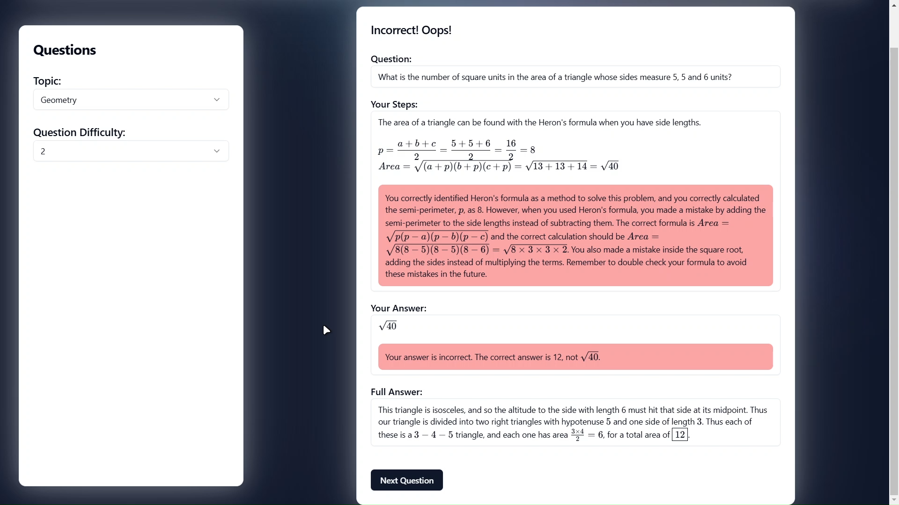

# AaravLabs Frontend

This is the frontend for AaravLabs. Aarav Labs is an innovative learning platform designed to help middle schoolers with AI steps and answer analysis. It combines tough but intresting questions with AI analysis to helps kids know what they got right or where they went wrong.

## Building

To build the frontend:
1. Build and deploy [the backend](https://github.com/AaravLabsOffical/Backend) and update the url in `.env` to match your backend url.
2. Go to `package.json` and replace the `--push` part of the `docker` script `yourusername/aaravlabs`
3. Run `npm i` to install required dependencies
4. Run `npm run docker` to build and push to Docker Hub

To use this, you need [the backend](https://github.com/AaravLabsOffical/Backend) too.
It is reccomended that you use the `docker-compose.yaml` given in [the main repository](https://github.com/AaravLabsOffical/AaravLabs) for the best experience.

## Usage

The project is a SvelteKit project, so check out the [Svelte docs](https://svelte.dev/docs/svelte/overview) or the [SvelteKit docs](https://svelte.dev/docs/kit/introduction) for general information.

All the publicly visible pages are in `/src/routes`.

All the components are in `/src/lib/componenets`. 
Each component is a .svelte file and a .md file that contains the documentation for the .svelte file. Components by `shadcn-svelte` are in `/src/lib/components/ui`.

To add a new page, create a `+page.svelte` in a folder with the name you want, then update the `/src/lib/componenets/navbar.svelte` file and add `<Navbar currentPage="PageName"></Navbar>` in the `+page.svelte` file.

To run the dev server, run `npm run dev`. To build to docker, check out the Building section of this document. To build without docker, run `npm run build` to build with Vite.